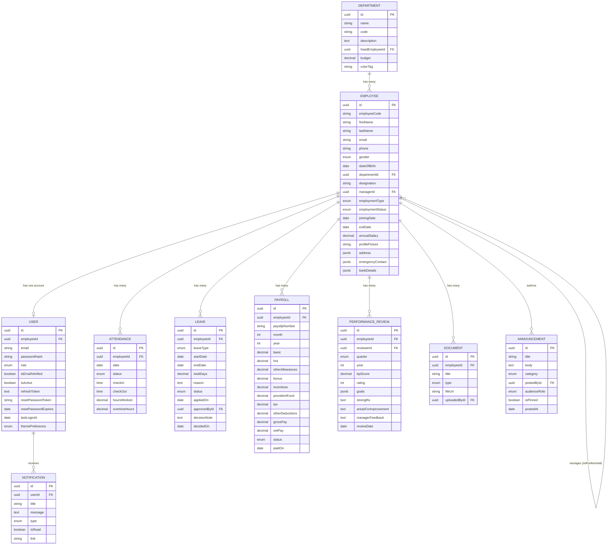

# Spreetail HR Portal — Entity Relationship Diagram

This is the logical data model behind the PostgreSQL schema in `migrations/001_init_schema.sql`.
Paste the block below into [mermaid.live](https://mermaid.live) or any Markdown viewer that supports
Mermaid (GitHub, GitLab, VS Code with the Mermaid extension) to render it visually.

## Notes

- All primary keys are UUIDs generated at the application layer (`DataTypes.UUIDV4`).
- `Employee.managerId` is a self-referential foreign key, forming the org chart.
- `Employee` and `User` are split intentionally: `Employee` is the HR system-of-record profile,
  `User` is the login/auth identity. This lets HR create an employee profile before (or without)
  provisioning system access.
- `Attendance` and `Payroll` both carry a unique composite index (`employeeId` + `date` /
  `employeeId` + `month` + `year`) to prevent duplicate records.
- See `migrations/001_init_schema.sql` for the exact PostgreSQL DDL (enums, indexes, constraints)
  generated from this model.
